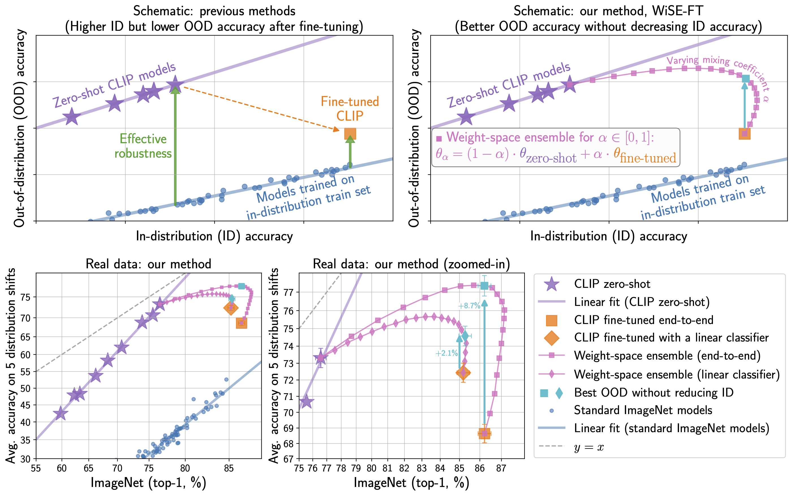
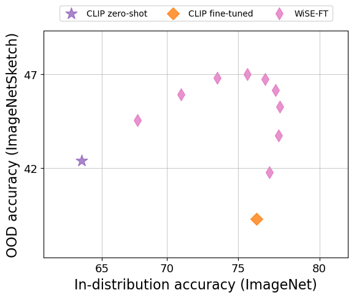
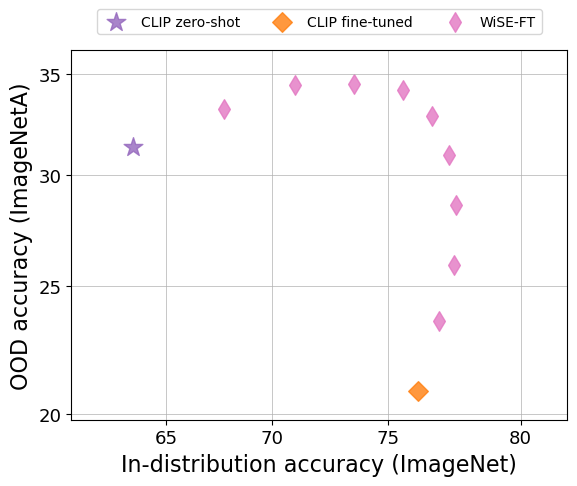
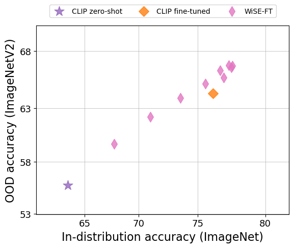

# Robust fine-tuning of zero-shot models

This repository contains code for the paper [Robust fine-tuning of zero-shot models](https://arxiv.org/abs/2109.01903).

<p align="center">

</p>

### Abstract
*Large pre-trained models such as CLIP offer consistent accuracy across a range of data distributions when performing zero-shot inference (i.e., without fine-tuning on a specific dataset).  Although existing fine-tuning approaches substantially improve accuracy in-distribution, they also reduce out-of-distribution robustness.  We address this tension by introducing a simple and effective method for improving robustness:  ensembling the weights of the zero-shot and fine-tuned models. Compared to standard fine-tuning, the resulting weight-space ensembles provide large accuracy improvements out-of-distribution, while matching or improving in-distribution accuracy.  On ImageNet and five derived distribution shifts, weight-space ensembles improve out-of-distribution accuracy by 2 to 10 percentage points while increasing in-distribution accuracy by nearly 1 percentage point relative to standard fine-tuning.  These improvements come at no additional computational cost during fine-tuning or inference.*

### Install dependencies


```bash
conda env create
conda activate wiseft
```

### Add directory to PYTHONPATH:

```bash
cd wise-ft
export PYTHONPATH="$PYTHONPATH:$PWD"
```

### Download data

When necessary, please refer to [datasets.md](datasets.md) for instructions on how to download datasets.

### Run WiSE-FT

Sample command when zeroshot and fine-tuned models are available:

```
python src/wise_ft.py   \
    --eval-datasets=ImageNet,ImageNetV2,ImageNetR,ImageNetA,ImageNetSketch  \
    --load=models/zeroshot.pt,models/finetuned.pt  \
    --results-db=results.jsonl  \
    --save=models/wiseft  \
    --alpha 0 0.1 0.2 0.3 0.4 0.5 0.6 0.7 0.8 0.9 1.0
```

Sample command for running WiSE-FT from scratch:

```
python src/wise_ft.py   \
    --train-dataset=ImageNet  \
    --epochs=10  \
    --lr=0.00003  \
    --batch-size=512  \
    --cache-dir=cache  \
    --model=ViT-B/32  \
    --eval-datasets=ImageNet,ImageNetV2,ImageNetR,ImageNetA,ImageNetSketch  \
    --template=openai_imagenet_template  \
    --results-db=results.jsonl  \
    --save=models/wiseft/ViTB32  \
    --alpha 0 0.1 0.2 0.3 0.4 0.5 0.6 0.7 0.8 0.9 1.0
```

Note: the flag `--freeze-encoder` controls whether only a linear classifier is fine-tuned, or if all weights are fine-tuned (end-to-end).

### Plotting results

Sample command for generating a scatter plot:

```
python src/scatter_plot.py  \
    --eval-datasets=ImageNetV2,ImageNetR,ImageNetA,ImageNetSketch  \
    --results-db=results.jsonl  \
    --save plots
```

### Expected results

We show samples of expected behavior below when running the commands above using ViT-B/32:

<p align="center">
  
    &nbsp; &nbsp; &nbsp; &nbsp;
  
</p>
<p align="center">
  
    &nbsp; &nbsp; &nbsp; &nbsp;
  
</p>


## Citing

If you found this repository useful, please consider citing:
```bibtex
@article{wortsman2021robust,
  title={Robust fine-tuning of zero-shot models},
  author={Wortsman, Mitchell and Ilharco, Gabriel and Li, Mike and Kim, Jong Wook and Hajishirzi, Hannaneh and Farhadi, Ali and Namkoong, Hongseok and Schmidt, Ludwig},
  journal={arXiv preprint arXiv:2109.01903},
  year={2021}
}
```
